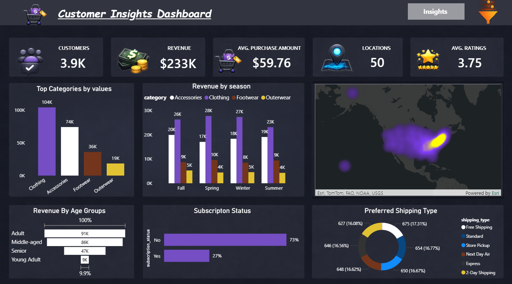
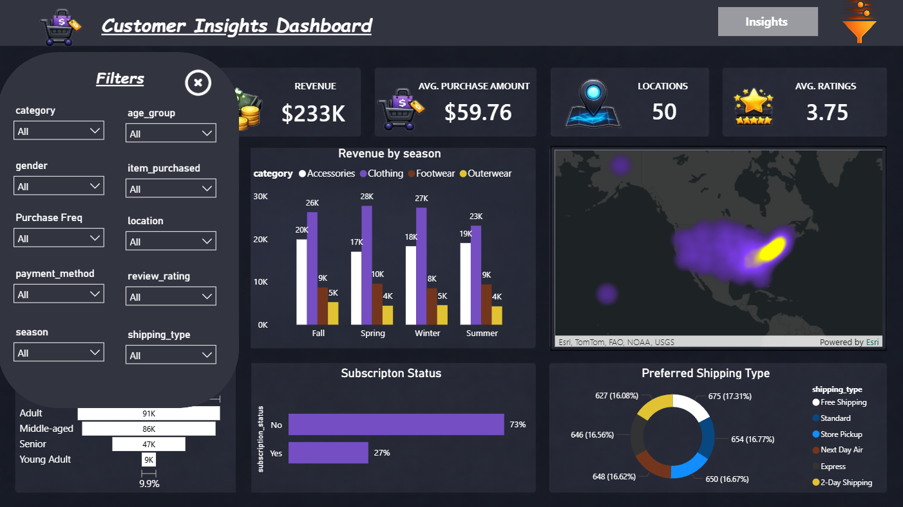
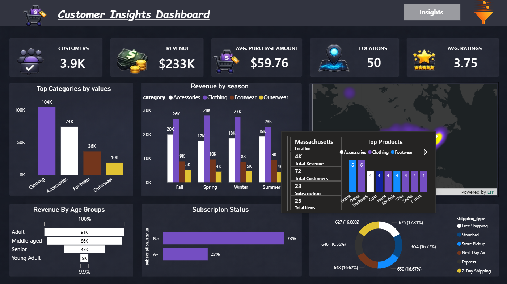
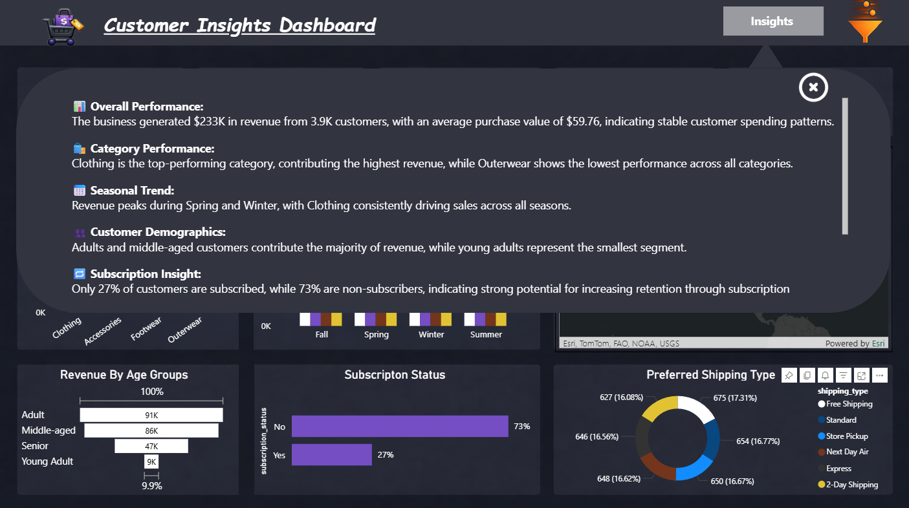

# 📊 Customer Insights Dashboard | End-to-End Data Analytics Project

## 🚀 Project Overview
This project delivers a complete end-to-end data analytics solution to analyze customer shopping behavior and identify key drivers of revenue, engagement, and retention.

The workflow integrates **Python for data preparation**, **SQL for business analysis**, and **Power BI for visualization**, transforming raw transactional data into actionable insights for decision-making.

---

## 🎯 Business Problem
A retail company wants to understand changing customer purchasing patterns across demographics, product categories, and shopping behavior.

### Key Questions:
- What drives revenue across customer segments?
- Which products and categories perform best?
- How do discounts, shipping, and reviews impact purchasing behavior?
- Are subscription programs effective in driving customer retention?
- Which regions contribute the most to customer activity?

---

## 📂 Dataset Overview
- **Total Records:** 3,900 transactions  
- **Total Features:** 18  
- **Data Includes:**
  - Customer demographics (Age, Gender, Location, Subscription Status)
  - Purchase details (Item, Category, Amount, Season, Size, Color)
  - Behavioral data (Discount, Frequency, Previous Purchases, Shipping Type, Review Rating)

---

# 🔄 End-to-End Pipeline

## 🧹 1. Data Preparation (Python)

### Key Steps:
- Loaded dataset using Pandas
- Performed structure analysis using `.info()` and `.describe()`
- Identified missing values (Review Rating column)

### Data Cleaning:
- Imputed missing review ratings using **median by category**
- Standardized column names to **snake_case**
- Removed redundant feature: `promo_code_used`

### Feature Engineering:
- Created `age_group` using binning
- Created `purchase_frequency_days`
- Validated consistency between discount and promo usage

### Output:
- Clean, structured dataset ready for SQL analysis
- Loaded into relational database (MySQL)

---

## 🗄️ 2. Data Analysis (SQL)

Performed structured business analysis using SQL queries.

### Core Analysis:

#### Revenue & Spending
- Revenue comparison by gender
- Identification of high-spending discount users

#### Product Insights
- Top 5 products by average rating
- Top 3 most purchased products per category (using window functions)

#### Customer Behavior
- Customer segmentation:
  - New
  - Returning
  - Loyal
- Repeat buyers vs subscription relationship

#### Business Drivers
- Discount dependency analysis (top discounted products)
- Shipping type impact on purchase amount
- Subscription vs non-subscription revenue comparison

#### Demographics
- Revenue contribution by age group

---

## 📊 3. Data Visualization (Power BI)

Developed an interactive dashboard for business stakeholders.

### Dashboard Features:
- KPI Cards:
  - Total Customers (3.9K)
  - Total Revenue ($233K)
  - Average Purchase Value ($59.76)
  - Locations (50)
  - Average Rating (3.75)

### Visuals:
- Revenue by category
- Revenue by season
- Revenue by age group
- Subscription distribution
- Shipping preference analysis
- Geographic heat map

### Interactivity:
- Dynamic slicer panel (filters)
- Custom tooltip (location-level insights)
- Insight pop-up panel
- Drill-down and cross-filtering

---

## 📸 Dashboard Preview

### 🔹 Main Dashboard

### 🔹 Filters Panel

### 🔹 Tooltip 

### 🔹Insights

---

## 📈 Key Insights

- **Category Leader:** Clothing generates the highest revenue (~$104K)
- **Seasonality:** Revenue peaks during Spring and Winter
- **Customer Segments:** Adults and middle-aged customers contribute the majority of revenue
- **Subscription Gap:** Only 27% of customers are subscribed → strong growth opportunity
- **Geographic Trends:** High activity in Montana, California, and Idaho
- **Discount Impact:** Some products are heavily dependent on discounts (>45%)

---

## 💡 Business Recommendations

- Increase subscription adoption with targeted campaigns
- Introduce loyalty programs to convert repeat buyers into loyal customers
- Optimize discount strategies to balance revenue and margins
- Focus marketing on high-performing categories (Clothing)
- Target high-value customer segments (Adults & Middle-aged)

---

## 🎯 Skills Demonstrated

- Data Cleaning & Preprocessing (Python)
- Feature Engineering
- SQL Analytics (CTEs, Window Functions, Aggregations)
- Data Visualization (Power BI)
- Business Analysis & Insight Generation
- Dashboard Design & UX Thinking

---

## 📌 Conclusion
This project demonstrates the ability to take raw customer data and transform it into meaningful insights using a structured analytics pipeline. It highlights how data-driven decisions can improve customer engagement, optimize sales strategies, and drive business growth.

---

## 🔗 Author
**Yash Patel**
